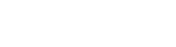
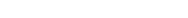
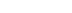
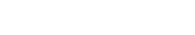

# idealGasSim
## Authors
Lorenzo Liam Baldisserri\
The project was also built on the work of the previous group members:\
Diego Quarantani\
Niccolo Poli\
Tomaso Tamburini
## Introduction
This project is a rudimentary event-based gas simulator operating in an euclidean three-dimensional space, with graphic data visualization and ROOT file output functionalities. It has the intent of allowing for clear visualization of the most basic phenomena described in kinetic theory of ideal gases, and the qualitative comparison of the theoretical results provided by said theory with their simulated counterparts.

It strives to achieve this by running a simulation of a physical system, representing a gas, and by subsequently processing the raw simulation data into meaningful statistical datasets and thermodynamical variables, stored making use of the formats provided by the ROOT framework, so that these can both be visualized and saved for later use.\
The visualization is also achieved through the output of a video feed (live or saved to a `.mp4` file) which enables the user to view the system's progression through time, both through its thermodynamical characteristics and through a direct video rendering of the system itself.\
The behaviour of the provided program is customizable to a limited degree, in almost all of its simulation parameters and aesthetical characteristics.
## Implementation choices
The project can be seen as divided in a set of three major interdependent components, and a minor one, reflected in [gasSim](../gasSim)'s subdirectory structure:
1. a physics engine ([PhysicsEngine](../gasSim/PhysicsEngine)), which provides the implementation of the used physical model and of the methods allowing for the simulation of its evolution through time
2. a graphics module ([Graphics](../gasSim/Graphics)), which provides a rudimentary 3D rendering engine with facilities that allow to take an "almost perspectically correct" picture of the gas
3. a data processing module ([DataProcessing](../gasSim/DataProcessing)), which provides a set of facilities allowing for storage of data relative to the simulation and its processing into more meaningful data.
    - This module also contains a pipeline for the data being output from the simulation, which allows for simultaneous (thread-safe) storage and processing (both statistical and graphical) of the raw simulation output,  direct external access to the statistical and graphical processing results and/or composition of the processed data into a coherent video output.\
    This component has been developed under the necessity of avoiding either an unsustainable memory footprint or an excessive slowness of the execution.

The codebase has been split up in one `.hpp`-`.cpp` couple for each class, with names matching the class' name, and one main executable. The only exception to this is the `getVideo` method for the `GS::SimDataPipeline` class, which has its own implementation file.
### PhysicsEngine
The physics engine provides the following set of components:

[`GS::GSVector`](../gasSim/PhysicsEngine/GSVector.hpp)\
A template floating point vector class, implementing the concept of three-dimensional vectors.\
This component allows for the flexibility to choose the floating point data structure to use based on the necessities posed by the implementation.\
It also provides the basic operations that can be performed on vectors (scalar multiplication, dot product, cross product).

[`GS::Particle`](../gasSim/PhysicsEngine/Particle.hpp)\
A uniform spherical particle implementation.\
This component allows for the representation and management of particles, sharing a common mass and radius (implemented as static atomic variables for thread-safe access).

[`GS::Collision`](../gasSim/PhysicsEngine/Collision.hpp)\
A set of three structs providing the facilities to manage particle-to-wall and particle-to-particle collision.
The dual nature of a collision has been dealt with through the use of dynamic polymorphism, so as to provide an uniform interface (implemented in the pure virtual Collision struct) for the "collision solving" `solve()` method and collision completion time class member, accessed through `getTime()`, used to compare collisions to choose the one with the smallest time.\
These structs have been designed with execution speed as the main focus, as they are extensively used in the main computational bulk of the simulation, and have therefore been implemented without checks ensuring correct usage of the provided methods (which would have required additional overhead), which have been delegated to the `GS::Gas` class itself instead.

The collision solving methods have been implemented as follows:\
For particle-to-particle collisions, the resulting speeds can be calculated by imposing three conditions on a pair of particles in contact with one another:
1. conservation of kinetic energy (elastic collision)
2. conservation of momentum (principle of conservation of momentum)
3. for the momentum exchange between the particles to be a vector linearly dependent with the vector connecting the two spheres' centers, as is the case for repulsive forces that are perpendicular to the contacting surfaces.

These conditions result in the following system and its solution, providing the general solution to the problem:

<p align="center">
  
</p>


This formula clearly yields valid results only under the condition that the two particles are actually in contact and that the dot product between their relative speed and their relative distance is negative.

For particle-to-wall collisions, the coordinate relative to the wall's perpendicular axis is simply flipped, as per the limit of a collision between an object with finite mass and a stationary one with mass approaching infinity.

[**GS::Gas**](../gasSim/PhysicsEngine/Gas.hpp)\
The class implementing the concept of an ideal gas, as a set of equal spherical particles bound to move inside of a cubical container.\
A simple diagram is shown below to provide a visual idea of how the Gas's container is represented, with the names given to the walls in the `GS::Wall` enum class:

<p align="center">
  
</p>

This class provides two main facilities:
 - Constructors, allowing the user to have full control over the desired starting conditions of the particles.
 - Methods allowing the user to simulate any number of interactions, optionally outputting the collision data to the simulation output pipeline.\
The simulation methods rely on the process of predicting all possible collision and comparing the time they would take to happen, then selecting the one with the smallest time and moving the entire gas by that time, finally calling the `solve()` method over said collision, and optionally adding the collision data to a provided data pipeline.

The collision finding process, implemented in the `firstPPColl()` and `firstPWColl()` private methods, is implemented as follows:
1. The first particle-to-wall collision is found by computing the collision time over the whole container of particles, substituting the result collision's value every time one with smaller time is found.
2. The first particle-to-particle collision is found in the same way by computing the collision time for all couples of particles and choosing the one with the smallest time.\
The time computation is divided in two steps:
    1. The relative distance of the two particles is checked to have negative dot product with the relative speed of the two particles, a cheap computation which provides the state of a condition necessary to the existance of a finite, positive collision time
    2. if the first step succeeds the actual collision time is computed through the following formula, which results from imposing the distance of the two particles to equate to the sum of their radiuses:

<p align="center">
  
</p>

<p align="center">
  
</p>

the quadratic formula above yields two values, and the smallest positive one is selected (if both are negative, `INFINITY` is substituted instead).
this is done across the whole set of particles with multiple threads, using [triangular indexing](https://stackoverflow.com/questions/27086195/linear-index-upper-triangular-matrix) to biject the set of all couples of particles with a set of indexes, through the following formulae:
The number of total checks can be easily found with the well known:

<p align="center">
  
</p>

And to get the two particle's indexes from the couple's corresponding index:

<p align="center">
  
</p>

Once the two collision times are found, they are compared and the one with the smallest time is selected.

### Graphics
This module provides two components:
 - [`GS::RenderStyle`](../gasSim/Graphics/RenderStyle.hpp), a simple collection of rendering parameters determining the aesthetical characteristics of a drawn gas
 - `GS::Camera`, a class allowing for a rudimentary, visually intuitive (almost perspectically correct) 3D rendering of a gas.

[**GS::Camera**](../gasSim/Graphics/Camera.hpp)\
A camera is essentially a focal point and a perspective plane, with the plane's normal vector defining the camera's viewing direction.

<p align="center">
  
</p>

`GS::Camera` has been implemented to have its bottom side always parallel to the xy plane, and care has been taken to manage the case of the provided sight vector being perpendicular to it.

`GS::Camera` provides a fundamental point projection method, `getPointProjection`, turning a point in 3D space into its projection.\
A point's projection is the result of intersecting the line that passes between the point and the camera's focus with the perspective plane. The resulting point is then written as a second 3D vector with the third component being a "depth" field, which is the scaling parameter to apply to a segment parallel to the perspective plane to get its projection's length (whose sign tells if the point is behind or in front of the focus), and the first two components as described after the scaling diagram below.

<p align="center">
  
</p>

The first two components are obtained by a change of coordinates, from the starting space to the reference system with its origin in the "camera sensor"'s center, and its x and y axes being the sensor's natural axes. They are then converted to their equivalent in pixels.\
The camera's internal reference system is represented in the following diagram:

<p align="center">
  
</p>

The point projection method is then used to add `GS::Particle` drawing functionalities, by drawing a circle where the particle should be and then scaling its radius according to the depth field; this method doesn't take into consideration the horizontal and vertical "stretching" of the images of objects as the projection gets closer to the edges of the image, but for reasonable fields of view this has no visible effect.\
These are used to provide two methods allowing for the drawing of a set of `GS::Particle` in space, which requires only the additional sorting, based on the depth field, of the projections so as to then iterate over the sorted projections container to draw them over each other, obtaining the closest ones to be drawn above the farthest, which yields correct results for non-overlapping, convex surfaces.

Finally, the point projection and particle drawing methods are used to add a set of helper functions which make it possible to draw a `GS::Gas` or a `GS::GasData`, through drawing its walls and its particles.\
Since the `GS::Gas` class guarantees the enclosure of the particles inside of their container, correctly drawing the gas is easily achieved by drawing the walls facing away from the camera, then the particles over them, then the walls facing the camera above everything else, as the geometry of a convex object (such as a cube) guarantees that looking at it from one direction will have the surfaces hidden from view possess normal vectors facing the same way as the observer's sight, therefore facing away from the observer.\
The information about the normal vectors and vertexes of the container sides has been computed by "brute-forcing" the six cases of the wall, as there was no need for the additional implementation which would have been required to implement it in a more implicit way.

### DataProcessing
This module provides three components, the third of which has been given a dedicated section:
- [`GS::GasData`](../gasSim/DataProcessing/GasData.hpp), which is essentially a Gas snapshot with associated collision information.\
It has been developed for storage of solved collisions' data, meaning that the contact between the colliding particle is still present, but the speeds have already been changed according to the collision solution.
- [`GS::TdStats`](../gasSim/DataProcessing/TdStats.hpp), a class providing the facilities to process GasData instances into meaningful information (through the `addData` method); used to turn the simulation data into "measurements".\
This class supports the bulking together of any number of subsequent GasData instances from the same Gas instance, through their processing into information of interest:
    - elapsed time
    - "temperature" (again, equivalent to average energy over a degree of freedom)
    - side of the box > walls area, box volume
    - cumulated wall pulses (necessary for average pulse/time > average force > average pressure)
    - last collision positions > can calculate the traveled distance for colliding particles from their previous collision positions > the mean free path
    - a histogram filled with the norm of the speed of every particle > can be compared/fitted to a Maxwell-Boltzmann distribution

The "insertion" of a new GasData instance is checked for minimal compatibility requirements.\
The copy and move constructors/assignment operators had to be implemented as non-standard to ensure that ROOT's internal memory management would not cause segmentation faults, by calling the `TH1` method `SetDirectory(nullptr)` on new instances of the `speedsH` class member.
### [GS::SimDataPipeline](../gasSim/DataProcessing/SimDataPipeline.hpp)
The last component of the DataProcessing module, providing a complete, thread safe simulation data pipeline.\
This class allows for storage of `GS::GasData` instances, through the `addData` method, the processing of said instances into `GS::TdStats` and/or `sf::RenderTexture` instances (stored inside of the class and available for access to the user) through the two `processData` methods, and composition of these intermediate results into a video format through the `getVideo` method.\
Moreover, a set of state checking/setting methods is provided, to allow for communication and synchronization with the rest of the program, which can check if the class is:
- out of `GS::gasData` to process
- actively processing a batch of `GS::gasData`

and inquire about the:
- number of `GS::gasData` instances in the queue
- number of `GS::TdStats`/`sf::Textures` in the intermediate result queues

Finally, it can use the `getDone`/`setDone` methods to communicate across its threads when the simulation thread is done adding `GS::gasData` instances for processing.

The behaviour of `getVideo` under multithreading calls can be tweaked in performance/responsiveness by setting the number of `GS::TdStats` chunks to be processed in one call of `getVideo`, through the `setStatChunkSize` method, so that it can provide pieces of the video feed to achieve a "buffering" behaviour, making the user wait less and the memory footprint remain acceptable.

Finally, two functions (`getStats`, `getRenders`) allow access to the intermediate result queues, either through copy or move semantics, to allow the user to be able to implement with minimal overhead their own secondary processing, if the options provided by `getVideo` don't satisfy their needs.

All functions are thread-safe under all circumstances, except for the `addData` function, the two `processData` functions and the `getVideo` function, which cannot be called from more than one thread at a time, and the `setFont` function, which is not thread-safe at all.\
The access to the private members is synchronized through the use of `std::mutex`, `std::lock_guard`, `std::unique_lock` and `std::condition_variable`, or by making the private members `std::atomic` when possible, and storing their `.load()`ed value at the beginning of functions that use them multiple times. A basic diagram is provided below in hopes of giving an intuitive representation of the class' main innerworkings:

The class is written so as to ensure that corresponding results are published together in the intermediate result queues, meaning that if there is a render at a given time, the `GS::TdStats` that covers a time period in which that render is present has been published as well, while the opposite is not necessarily true as `GS::TdStats` instances can be processed without processing the renders, for speed's sake.\
This is ensured by publishing results under the lock of the `outputMtx` data member as well as the more widely used `statsMtx` and `rendersMtx`. `outputMtx` is locked by getVideo as well, since it's the only function which also accesses both queues.

<p align="center">
  
</p>

[**GS::SimDataPipeline::getVideo**](../gasSim/DataProcessing/getVideo.cpp)\
This function is a video composition facility, which allows for the composition of processed `GS::TdStats` and `sf::Texture` instances into a coherent video output, in the form of a `std::vector<sf::Texture>`.\
It offers four options for results composition, implemented through an enum class, `GS::VideoOpts`:
1. `justGas`, outputting just the renders and inserting placeholders in place of eventual missing ones
2. `justStats`, using just the `GS::TdStats` instances, providing a graph only video feed, thought for visualization of systems with a lot of particles
3. `gasPlusCoords`, showing just the gas and its measured thermodynamic coordinates
4. `all`, showing the gas, its measured thermodynamic coordinates, the particle speed norm distribution and the mean free path graph

The function can be seen as one big case structure, divided in three stages:
1. data extraction, where chunks of information that can be composed into a video are taken from the intermediate results queues
2. recurrent variables setup, where variables necessary to the later stage are initialized
3. video composition, where the data chunks are processed into a final format

The data extraction phase operates depending on the case:\
As a first step, it always checks the `fTime` variable, which indicates the time corresponding to the last frame output by `getVideo`, needs to be set, and sets it according to the following fallback structure:
1. if any renders are available, it is set so that its difference with the time of the first render is an integer multiple of the time given to each frame (the inverse of the framerate), basically syncing it up to the renders. This happens both if it isn't synced to the renders or if it isn't set.
2. if any `GS::TdStats` instances are available and it hasn't been set yet, it is set so as to be as close as possible to the beginning of the first `GS::TdStats` instance available
3. if the `gTime` variable is available, it is set to its value

Essentially, `fTime` gives "memory" to the getVideo function, which thanks to it can know where it stopped, and through the guarantees given about the published data, always know if the data between `fTime` and `gTime` has has either been deleted/made unavailable to it (for example by changing the framerate mid run, effectively putting all of the previously processed renders out of sync) or not published, so as to know where to stop to get published data chunks to process.\
After setting the `fTime` variable and acquiring the necessary parameters, it extracts data depending on the case:
 - `justGas` > extracts all of the available renders
 - `justStats` > extracts all of the available TdStats
 - `gasPlusCoords`/`all` > extracts chunks of `GS::TdStats` and renders available after `fTime`, and such that the render times are contained within the `GS::TdStats` instances' time frames.

The video composition phase, while differing slightly between cases, operates on the same principle: starting from the `fTime` variable, it proceeds for all subsequent integer multiples of the frame time, checking for missing data/renders and inserting placeholders as needed.\
Since the user has no way to partially delete the `stats` deque's contents, the function can be sure that if it hasn't touched a member of said queue yet (guaranteed by it being after `fTime`), the presence of said member implies that all successive instances in the container are contiguous in time, so it only has to insert placeholder graph values from `fTime` to the `stats` container's front starting time.\
After inserting the placeholder values, and drawing all the renders in the placeholder timeframe, it can proceed to draw the `stats` instances one by one.\
It makes use of this by adding the data from an instance to the ROOT objects and drawing them once, then pasting the renders onto it one over another, checking that for each render the render for the frame time is actually available, and inserting a placeholder if that is not the case.\
In this phase, the user is given the freedom to perform operations on the ROOT objects that get drawn, both in the phase directly before the drawing of the root objects and directly after them, by passing `std::function` instances that get called by the `getVideo` function.
### Main executable
The main executable uses all of the previously mentioned facilities to simulate a gas's evolution through time, process its data and compose it into a video output.\
It does so in three phases:
1. it gets input parameters and loads resources according to them, validating them for acceptability.
2. it constructs the gas and data pipeline, and sends a simulation and a processing thread.
3. it starts either the video feed or the video saving process

The video saving process simply calls getVideo until the state of the pipeline indicates that the simulation is done and that there is no more processing going on, encoding the results of each getVideo call into an ffmpeg pipe opened to an .mp4 file on the filesystem.

The video feed is made up of three main components:\
**A buffering loop**\
Controlled through an `std::atomic<bool>` flag, that is started when there are no more frames available to draw while waiting for more to be prepared. It draws a buffering wheel and some info about the state of the simulation.\
**A set of player threads**\
These wait for their turn through their queue number, compared with an `std::atomic<size_t>` telling them the queue number that is free to start drawing to the `sf::RenderWindow`, then draw to the window the frames passed to them through an `std::shared_ptr<std::vector<sf::Texture>>`, finally checking if there are any player threads in line behind them and signaling the buffering loop to start up again if that is not the case.\
Each player thread therefore depends on the thread before it to be able to run and finish.\
**The main thread**\
It calls `getVideo`, storing its result through `std::shared_ptr<std::vector<sf::Texture>>` and sending the player threads with their queue number and passing them the `std::shared_ptr<...>`, then detatching them so as to be able to keep sending player threads instead of stalling the `getVideo` calls.\
It ensures that the detatched threads are all finished by joining the last thread it sends, since it depends on the thread sent before it to exit to be able to execute, which therefore ensures inductively that all of other detatched threads are finished.\
The access to the `sf::RenderWindow` to which the results are displayed is managed through an `std::mutex`, locked with `std::lock_guard`, and the player theads and buffering loop are coordinated through an `std::atomic<bool>` stop signal, which is used for the simulation and processing threads, and a buffer loop kill signal of the same type which is used only by the buffer loop.\
When any one of these threads is in possession of the window, it also checks for a window close signal and sets the `stop` and `killBufferLoop` flags to true to stop all drawing and make the threads exit as quickly as possible.

At the end of the execution, the main thread joins all previously unjoined threads and either saves the results or skips it if it detects a user-driven ending signal.

## External libraries
The project depends on ROOT 6.36.00, which can be installed through the snap package manager or directly through its binary release, and on SFML 2.6.1, provided by the package libsfml-dev.
To install SFML, run:
```
sudo apt install libsfml-dev
```
## Execution instructions
The project provides a main executable, found under the name `idealGasSim` in the build directory. Execution allows for passing a .ini configuration file path, through the -c option.
### Customizing the parameters
The simulation tries to generate the gas as a set of particles with randomized speeds, with uniformly distributed module and direction, fitting them in a cubical lattice inside of the container; it then proceeds to simulate the system's evolution through a given number of events (collisions), and divides the collisions in sets of equal number, on which statistical analysis and "measurements" are performed.\
It either saves the video output or streams it as the simulation is run.\
The user can customize the parameters determining the output through a .ini configuration file. A reference version, containing all of the customizable parameters and their accurate description, set to values that output a meaningful demo, can be found at `configs/gasSim_demo.ini`.
### Tweaking the ROOT input file
The configuration of the root data structures used during the simulation can be tweaked by regenerating the input file itself, from which they are loaded, using the macro [`makeInputFile.cpp`](../makeInputFile.cpp) from a ROOT prompt, which can be modified as desired.\
The requirements for the objects are as follows:
- The objects that act as containers (`TGraph`, `TH1D`) must be empty
- The objects must be saved under the same names and be of the same types as the ones in the default [`input.root`](../inputs/input.root) file 

As for the demo config file, the default file found at `inputs/input.root` provides a set of working and meaningful presets, and the macro used to generate it can be taken as a reference for what to feed the simulation.
### ROOT output file
The ROOT output file can be inspected through ROOT's `TBrowser`, by opening up a ROOT prompt and initializing a `TBrowser` instance through it, then using the graphical browser to open up the output file.\
The program will have stored in it the graphs drawn in the video and a `TH1D` in which all of the drawn speeds histograms have been cumulated, so as to show how over the whole execution time, the average distribution matches a Maxwell-Boltzmann distribution.

## Results interpretation
Execution with different configuration highlights a predictable deviation from the theoretical results used in the kinetic theory of ideal gases.\
The deviation shown is from the expected and measured pressures: by changing just the particles' radius in the configuration file, one can observe that with its increase, the measured pressure increases, making the "measured" Boltzmann constant (expected as 1 J/(Temperature unit)) increase with it.\
This is due to the fact that the particles, having a non-negligible volume, shrink the effective size of the container as well as the real free volume inside of it, and, having less room to move around in, hit the walls more frequently, increasing the pressure.

On all of the used configurations, the mean free path's expected value was way above the measured value, and while the fact that the container's size is usually of the same order of magnitude as the mean free path might be the cause of this discrepancy, no definitive conclusions have been made.

The particle speed distribution has instead been observed to perfectly match the expected Maxwell-Boltzmann distribution, and starting the system from a different speed distribution (an almost uniform one) shows the spontaneous progression towards the expected distribution.

## Testing strategy
The tests have been implemented through two different executables, one using the traditional unit tests approach, and the other providing two less rigorous demos and a "stress test".
### [Unit tests](../unitTesting/unitTests.cpp)
The unit tests have been written with two main objectives:
- To ensure correct parameter validation, by passing parameters in the invalid ranges and at the edges between valid and invalid ranges.
- To ensure behaviour coherent with the physical models and results used, by testing different cases whose results have been previously worked out on paper. The used configurations have been chosen both in valid ranges and at the edges of the valid ranges.
The parts of the program tested through this executable are listed as follows:
- All of PhysicsEngine
- Most of Graphics, excluding the functions returning image outputs
- All of `GS::GasData` and most of `GS::TdStats`
- The functions from `GS::SimDataPipeline` not directly dealing with/outputting images.

These can be executed through CMake, appending to the compile command the `--target test` flags.
### [Demos/stress test](../unitTesting/getVideoTest.cpp)
This executable implements two demos and a stress test of the `getVideo` function, and in the process validates the efficacy of the image outputting functions provided by the Graphics module.

It does so by testing the function for correct parameter validation through Doctest's facilities, as has been done in the unit tests, and then calling it to provide a video output with weird parameters, such as non-matching render resolution and window resolution or the smallest available resolutions passed as parameters, which is displayed to the user for inspection, and can be replayed indefinitely to try and spot errors. This is done in the `all` and `justStats` configurations, with a single particle gas and a multiple particle gas respectively.\
Finally, through a simple thread managing facility, provided in the [testing addons](testingAddons.hpp), it performs a `GS::SimDataPipeline` stress test to show how it holds up under calls of all methods by multiple threads at random times, with random deletion of the intermediate results queues and random values of the given `GS::VideoOpts` instance, outputting the video feed to the user while showing which functions get called, and with what parameters, through the standard output. This test can be run as many times as the user likes.

To execute it, from the unitTesting directory, call the executable found in the build directory, called `getVideoTest.t`. The environment is necessary as a folder named `assets` equal to that found in the unitTesting directory needs to be in the directory from which the binary is called, as the paths have been hardcoded inside of it.
## Generative AI usage
During developement ChatGPT has been used, almost exclusively as a way to get indicative information about the facilities provided by the used libraries, and in a couple of instances to write code snippets:
 - in the file found at `gasSim/DataProcessing/SDPGetVideo.cpp`, to write the RGBA32toRGBA8 auxiliary function
 - in the file found at `main.cpp`, to write the ffmpeg pipe opening command

## Writing period
This project has been written in the period between the 7th of May, 2024 and the 16th of January, 2026

