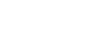
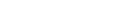

# idealGasSim
## Authors
Lorenzo Liam Baldisserri\
The project was also built on the work of the previous group members:\
Diego Quarantani\
Niccolo Poli\
Tomaso Tamburini
## Introduction
This project is a rudimentary event-based gas simulator operating in an euclidean three-dimensional space, with graphic data visualization and ROOT file output functionalities. It has the intent of allowing for clear visualization of the most basic phenomena described in kinetic theory of ideal gases, and the qualitative comparison of the theoretical results provided by said theory with their simulated counterparts.

It strives to achieve this by running a simulation of a physical system, representing a gas, and by subsequently processing the raw simulation data into meaningful statistical datasets and thermodynamical variables, stored making use of the formats provided by the ROOT framework, so that these can both be visualized and saved for later use.\
The visualization is achieved through the output of a video feed (live or saved to mp4) which enables the user to view the system's progression through time, both through its thermodynamical characteristics and through a direct video rendering of the system itself.\
The behaviour of the provided program is customizable to a limited degree, in almost all of its simulation parameters and aesthetical characteristics.\
Finally, the developed facilities are also made accessible through the project's library, which can be used to implement more extensive and precise data processing, if desired.
## Implementation choices
The project can be seen as divided in a set of three major interdependent components, and a minor one, reflected in [gasSim](../gasSim)'s subdirectory structure:
1. a physics engine ([PhysicsEngine](../gasSim/PhysicsEngine)), which provides the implementation of the used physical model and of the methods allowing for the simulation of its evolution through time
2. a graphics module ([Graphics](../gasSim/Graphics)), which provides a rudimentary 3D rendering engine with facilities that allow to take an "almost perspectically correct" picture of the gas
3. a data processing module ([DataProcessing](../gasSim/DataProcessing), which provides a set of facilities allowing for storage of data relative to the simulation and its processing into more meaningful data.
    - This module also contains a pipeline for the data being output from the simulation, which allows for simultaneous (thread-safe) storage of the raw simulation output, processing (both statistical and graphical), direct external access to the statistical and graphical processing results and/or composition of the processed data into a coherent video output.\
    This component has been developed under the necessity of avoiding either an unsustainable memory footprint or an excessive slowness of the execution.
The codebase has been split up in one header-implementation couple for each class, with names matching the class' name, and one main executable.
### PhysicsEngine
The physics engine provides the following set of components:

[**gs::GSVector**](../gasSim/PhysicsEngine/GSVector.hpp)\
A template floating point vector class, implementing the concept of three-dimensional vectors.\
This component allows for the flexibility to choose the floating point data structure to use based on the necessities posed by the implementation.\
It also provides the basic operations to perform on vectors (scalar multiplication, dot product, cross product).

[**gs::Particle**](../gasSim/PhysicsEngine/Particle.hpp)\
A spherical uniform particle implementation.\
This component allows for the representation and management of particles, sharing a common mass and radius (implemented as static atomic variables for thread-safe access).

[**gs::Collision**](../gasSim/PhysicsEngine/Collision.hpp)\
A set of three structs providing the facilities to manage particle-to-wall and particle-to-particle collision.\
The dual nature of a collision has been dealt with through the use of dynamic polymorphism, so as to provide an uniform interface (implemented in the pure virtual Collision struct) for the "collision solving" `solve()` method and collision completion time class member, accessed through `getTime()`, used to compare collisions to choose the one with the smallest time.\
These structs have been designed with execution speed as the main focus, as they are extensively used in the main computational bulk of the simulation, and have therefore been implemented without checks ensuring correct usage of the provided methods (which would have required additional overhead), which have instead been delegated to the `gs::Gas` class itself.

The collision solving methods have been implemented according to the following formulas:\
For particle-to-particle collisions, the resulting speeds can be calculated by imposing three conditions on a pair of particles in contact with one another:
1. conservation of kinetic energy (elastic collision)
2. conservation of momentum (principle of conservation of momentum)
3. for the momentum exchange between the particles to be a vector linearly dependent with the vector connecting the two spheres' centers, as is the case for repulsive forces that are perpendicular to the contacting surfaces.\
These conditions result in the following system and its solution, providing the general solution to the problem:\
<p align="center">
  
</p>
<p align="center">
  
</p>
This formula clearly produces valid results only under the condition that the two particles are actually in contact and that the dot product between their relative speed and their relative distance is less than zero.\
For particle-to-wall collisions, the coordinate relative to the wall's perpendicular axis is simply flipped, as per the limit of a collision between an object with finite mass and a stationary one with mass approaching infinity.

[**gs::Gas**](../gasSim/PhysicsEngine/Gas.hpp)\
The class implementing the concept of an ideal gas, as a set of equal spherical particles bound to move inside of a cubical container.\
This Class provides two main facilities:
 - Constructors, allowing the user to have full control over the desired starting conditions of the particles.
 - Methods allowing the user to simulate any number of interactions, optionally outputting the collision data to the simulation output pipeline.\
The simulation methods rely on the process of predicting all possible collision and comparing the time they would take to happen, then selecting the one with the smallest time and moving the entire gas by that time, finally calling the `solve()` method over said collision.

The collision finding process, implemented in the firstPPColl() and firstPWColl() methods, is implemented as follows:
1. The first particle-to-wall collision is found by computing the collision time over the whole container of particles, substituting the result collision's value every time one with smaller time is found.
2. The first particle-to-particle collision is found by computing the collision time for all couples of particles.\
The time computation is divided in two steps:
    1. The relative distance of the two particles is checked to have negative dot product with the relative speed of the two particles, a cheap computation which provides the state of a condition necessary to the existance of a finite collision time
    2. if the first step succeeds the actual collision time is computed through the following formula, which results from imposing the distance of the two particles to equate to the sum of their radiuses:\
<p align="center">
  
</p>
<p align="center">
  
</p>
the quadratic formula above usually yields two values, of which the one with smallest modulus is selected.
this is done across the whole set of particles with multiple threads, using triangular indexing to biject the set of all couples of particles with a set of indexes, through the following formulae:
The number of total checks can be easily found with the well known:
<p align="center">
  
</p>
And to get the two particle's indexes from the couple's corresponding index:
<p align="center">
  
</p>
Once the two "best" collisions are found, they are compared and the one with the smallest time is selected, then the gas particles are shifted through their speeds by that time, and the collision, once "contact" has been achieved, is solved. This whole process simulates one event, and is repeated for the amount of times specified by the user. In the case that the overload providing data recording is used, the simulation data is recorded inside of a given instance of the pipeline class after the resolution of the collision has been completed.
### Graphics
This module provides two components:
 - RenderStyle, a simple collection of rendering parameters determining the aesthetical characteristics of a drawn gas 
 - Camera, a class implementing the concept of perspective, allowing for a rudimentary visually intuitive (almost perspectically correct) 3D rendering of a gas.

The camera class provides a fundamental point projection method, turning a point in 3D space into its projection, with its pixel coordinates, which can be used to draw it onto an image, and a depth field, which contains the information about its distance from the camera plane, which among other things can be used for scaling purposes.
This point projection method is then used to add particle drawing functionalities, by drawing a circle where the particle should be and then scaling it according to the depth field. These are used to provide two methods allowing for the drawing of a set of particles in space, which requires only the additional ordering, based on the depth field, of the projections so as to then iterate over the projections container and draw them one over another, having the closest ones seen above the farthest, as is the case for convex objects such as spheres are.
Finally, the point projection and particle drawing methods are used to add a set of helper functions which make it possible to draw a Gas, through drawing its walls and its particles. Since the Gas class guarantees the enclosure of the particles inside of their container, correctly drawing the gas is easily achieved by drawing the walls facing away from the camera, then the particles over them, then the walls facing the camera over them, as the geometry of a convex object guarantees that looking at it from one direction will have the surfaces hidden from view possess normal vectors facing the same way as the observer's sight, therefore facing away from the observer. The cube happens to be a convex object. The information about the gas's normal vectors has been computed by "brute-forcing"the six cases of the wall, as there was no need for the additional implementation which would have been required to implement it in a more implicit way. SILLYYYYY

### DataProcessing
This module provides three components, the third of which will be explained in its own section:
 - GasData, which is essentially a Gas snapshot with collision information associated. It has been developed for storage of solved collisions, meaning that the contact between the colliding objects is still present, but the speeds have already been changed according to the collision solution.
 - TdStats, a class providing the facilities to process GasData instances into meaningful information. This is the class that turns the simulation data into "measurements"
 This class supports the bulking together of any number of subsequent GasData instances from the same Gas instance, and their processing into information of interest:
 * elapsed time
 * "temperature" (again, just average energy over a degree of freedom)
 * side of the box -> walls area, box volume
 * cumulated wall pulses (necessary for average pulse/time -> average force -> average pressure)
 * last collision positions -> the possibility to calculate the free paths for each particle at the time of their collision -> the mean free path
 * Histogram filled with the norm of the speed of every particle -> possibility to compare with a Maxwell-Boltzmann distribution
The "insertion" of a new GasData instance is checked for some minimal compatibility requirements
The copy and move constructors/assignment operators had to be implemented as non-standard to ensure that ROOT's internal memory management would not cause segmentation faults by calling the TH1 method SetDirectory(nullptr).

#### SimDataPipeline
The last component of the DataProcessing module, providing a complete, thread safe simulation data pipeline, with two exit points: one for raw processed data in the form of TdStats and/or sf::Textures, and another for a video output, in the form of sf::Textures, containing a customizable assortment of the previous raw results in a graphical form.
This class allows for storage of gasData instances, through the addData method, the processing of said instances into TdStats and/or sf::RenderTexture instances (stored inside of the class and available to the user) through the two processData methods, and composition of these intermediary results into a video format through the getVideo method.
In addition to these, a set of state checking/setting methods is provided, to allow for communication and synchronization with the rest of the program, which can ask the class wether it is:
 - out of gasData to process
 - actively processing a batch of gasData
and inquire about the:
 - number of gasData instances in the queue
 - number of TdStats/sf::Textures in the intermediate result queues
And can use the getDone/setDone methods to communicate across its threads when the simulation thread is done adding gasData instances.
The behaviour of getVideo under multithreading calls can be tweaked in performance/responsiveness by setting the number of TdStats chunks to be processed in one call of getVideo, through the setStatChunkSize method, so that the simulation doesn't take bites that are too big to chew, leaving you waiting for a minute while it chugs along all TdStats, filling up your memory with sf::Textures that you would be very happy to be seeing while it processes the other.
Finally, two functions (getStats, getRenders) allow access to the intermediate result queues, either through copy or move semantics, to allow the user to be able to implement with minimal overhead his own secondary processing, if the flexibility provided by getVideo doesn't satisfy their needs.
All functions are thread-safe under all circumstances, except for the addData function, the two processData functions and the getVideo function, which cannot be called from more than one thread at a time, and the setFont function, which is not thread-safe at all.
##### getVideo
This function is a half-baked video composition facility, which offers the composition of processed TdStats and sf::Texture instances into a coherent video output, in the form of sf::Texture instances.
It offers four modes of results composition:
 - justGas, outputting just the renders and inserting placeholders in place of eventual missing ones
 - justStats, using just the TdStats instances, providing a graph only video feed, thought for visualization of systems with numerous particles
 - gasPlusCoords, showing just the gas and its measured thermodynamic coordinates
 - all, showing the gas, its measured thermodynamic coordinates, the particle speed norm distribution and the mean free path graph
The function can be seen as a big case structure, divided in three stages:
 - data extraction phase, where chunks of information that can be composed into a video are taken from the intermediate results queues
 - recurrent variables setup, where variables necessary to the later stage are set up
 - video composition phase, where the data chunks are processed into a final format
The data extraction phase operates depending on the case:
As a first step, it always sets the fTime variable, the variable indicating the time corresponding to the last frame output by getVideo, which is set according to the following fallback structure:
if any render times are available, it is set so that its difference with the time of the first render is an integer multiple of the time given to each frame (the inverse of the framerate), basically syncing it up to the renders. This happens both if it isn't synced to the renders or if it isn't set.
if any stats are available and it hasn't been set yet, it is set so as to be as close to the beginning of the first TdStats instance available
Essentially, fTime constitutes a "memory" of the getVideo function, which thanks to it can know where it stopped, and through the class invariant that where there are published renders, the corresponding TdStats have also necessary been published, always know if the data it has has either been deleted/made unavailable to it (for example by changing the framerate mid run, effectively putting all of the previously processed renders out of sync) or not published, so as to know where to stop to get published data chunks to process.
After setting the fTime variable and acquiring the necessary parameters, it extracts data depending on the case:
 - justGas -> extracts all of the available renders available
 - justStats -> extracts all of the available TdStats available
 - gasPlusCoords/all -> extracts chunks of TdStats and renders available after fTime, and such that the renders are contained within the TdStats
The video composition phase, while differing slightly between cases, operates on the same principle: starting from the fTime variable, it proceeds for all subsequent integer multiples of the frame time, checking for missing data/renders and inserting placeholders as needed. Since the user has no way to partially delete TdStats, the function can be sure that if it hasn't touched a TdStats yet (it being after fTime), the presence of a TdStats implies that all successive TdStats in the vector are contiguous in time, so it only has to insert placeholder graph values from fTime to the TdStats instances' front starting time, then can happily chug along without worrying about missing TdStats instances. It makes use of this by rendering once a the graphs corresponding to a TdStats instance, then pasting the renders onto the graphs, checking that for each render the render for the frame time is actually available, and inserting a placeholder if that is not the case.
In this phase, the user is given the freedom to perform operations on the ROOT object that get drawn, both in the phase directly before the drawing of the root objects and directly after them, by passing std::functions that get called by the getVideo function.

### Main executable
The main executable uses all of the previously mentioned facilities to simulate a gas, process its data and compose it into a video output.
It does so in three phases:
First it gets input parameters and loads resources according to them, validating them for correctness.
Then it constructs the gas and data pipeline, and sends a simulation and a processing thread.
Then it starts either the video feed or the video saving process:
The video saving process simply calls getVideo until the state of the pipeline indicates that the simulation is done and that there is no more processing going on, encoding the results of each getVideo into an ffmpeg pipe opened to an .mp4 file on the filesystem.
The video feed is more complicated, and is composed of three main components:
A buffering loop, controlled through an atomic flag, that is started when there are no more frames available to draw while waiting for more to be prepared.
A set of player threads, which wait for their turn through their queue number, compared with an atomic size_t telling them the queue number that is free to start drawing to the window, then draw to the window the frames passed to them through an std::shared_ptr to a vector of sf::Textures, finally checking if there are any player threads in line behind them and signaling the buffering loop to start up again if that is not the case.
The main thread, which calls getVideo, storing its result through shared_ptrs and sending the player threads with their queue number and passing them the shared_ptr to the set of renders they need to display.
The access to the sf::RenderWindow to which the results are displayed is managed through an std::mutex, locked with std::lock_guards, and the player theads and buffering loop are coordinated through an atomic stop signal, which is used for the simulation and processing threads, and a killBufferLoop flag which is used only by the buffer loop. When each thread is in possession of the window, it also checks for an eventual window close signal and sets the stop and killBufferLoop flags to true to stop all drawing.
In an ending phase, it joins all previously unjoined threads and either saves the results or skips it if it detects an user-driven ending signal.

## External libraries
The project depends on ROOT 6.36.00, which can be installed through the snap package manager or directly through its binary release, and on SFML 2.6.1, provided by the package libsfml-dev.
To install SFML, run:
```
sudo apt install libsfml-dev
```
## Execution instructions
The project provides a main executable, found under the name `idealGasSim` in the build directory. Execution allows for passing a .ini configuration file path, through the -c option.
### Customizing the parameters
The simulation tries to generate the gas as a set of particles with randomized speeds, with uniformly distributed module and direction, fitting them in a cubical lattice inside of the container; it then proceeds to simulate the system's evolution through a given number of events (collisions), and divides the collisions in sets of equal number, on which statistical analysis and "measurements" are performed. It either saves the video output or streams it as the simulation is run.
The user can customize the parameters determining the output through a .ini configuration file. A reference version, containing all of the customizable parameters and their accurate description, set to values that output a meaningful demo, can be found at `configs/gasSim_demo.ini`.
### Tweaking the ROOT input file
The configuration of the root data structures used during the simulation can be tweaked by regenerating the input file itself, from which they are loaded, using the macro mainInputFile.cpp from a ROOT prompt, which can be modified as desired. The requirements for the objects are as follows:
 - The objects that act as containers (TGraph, TH1D) must be empty
 - The objects must be saved under the same names and be of the same types as the ones in the default root file
As for the demo config file, the default file found at `inputs/input.root` provides a set of working and meaningful presets, and the macro used to generate it can be taken as a reference for what to feed the simulation.

## Generative AI usage
During developement ChatGPT has been used, almost exclusively as a way to get indicative information about the facilities provided by the used libraries, and in a couple of instances to write code snippets:
 - in the file found at `gasSim/DataProcessing/SDPGetVideo.cpp`, to write the RGBA32toRGBA8 auxiliary function
 - in the file found at `main.cpp`, to write the ffmpeg pipe opening command

## Writing period
This project has been written in the period between the 7th of May, 2024 and the 16th of January, 2026

